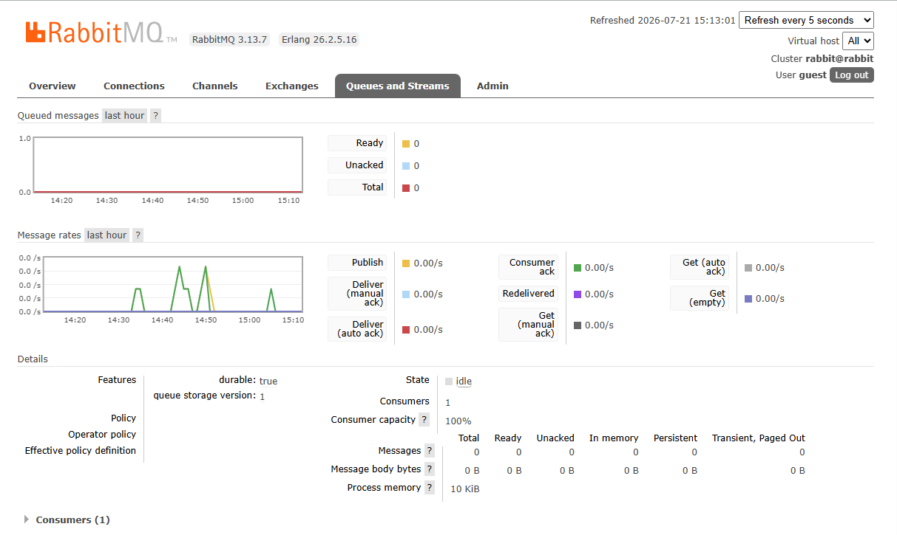
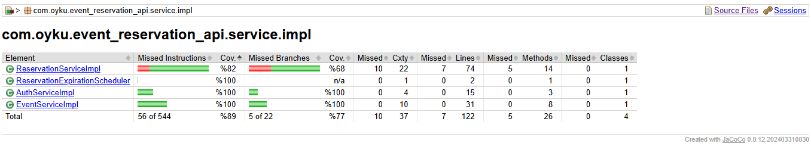
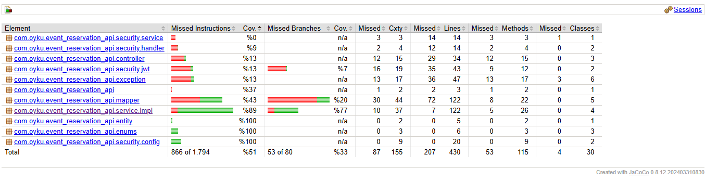

# 🎟️ Spring Boot Event Reservation REST API
 
<div align="center">
 
*A secure and scalable Event Reservation REST API built with Spring Boot, PostgreSQL, Redis, RabbitMQ, Docker, and Spring Security. The project demonstrates JWT authentication, role-based authorization, Redis caching, Redis-based rate limiting, asynchronous messaging with RabbitMQ, optimistic locking for concurrency control, scheduled tasks, comprehensive testing, and code coverage analysis.*


</div>

---
 
# 📌 Project Overview
 
Spring Boot Event Reservation API is a RESTful backend application developed for managing events and seat reservations securely and efficiently.
 
The project follows a layered architecture and demonstrates modern backend development concepts including JWT authentication, role-based authorization, DTO mapping, validation, global exception handling, scheduled tasks, optimistic locking, and comprehensive testing.
 
Unlike the original internship project specification, which suggested Java 17 and MongoDB, this implementation uses **Java 23** and **PostgreSQL** together with **Spring Data JPA** and **Hibernate** to provide a relational database solution.
 
The application allows administrators to manage events while authenticated users can reserve, confirm, and cancel reservations. To improve performance, frequently accessed event data is cached using Redis. The API also includes Redis-based rate limiting to protect endpoints from excessive requests and integrates RabbitMQ for asynchronous reservation event processing. Data consistency is ensured through scheduled reservation expiration and JPA Optimistic Locking.

---
 
# 🚀 Features
 
## 🔐 Authentication & Authorization
 
- User registration
- User login with JWT
- Password encryption
- Stateless authentication
- Role-based authorization (ADMIN / USER)
- Protected REST endpoints
---
 
## 🎫 Event Management
 
- Create events
- Update events
- Delete events
- Retrieve all events
- Retrieve event details
- Automatic seat generation during event creation
- Retrieve seats for an event
---
 
## 🎟 Reservation Management
 
- Create reservations
- Confirm reservations
- Cancel reservations
- Retrieve reservation details
- Retrieve the authenticated user's reservations
- Automatic reservation expiration
- Automatic seat status management
---
 
## ⚡ Concurrency Control
 
- Prevents double booking using JPA Optimistic Locking (`@Version`)
---

## 🚀 Redis Caching

- Cache frequently accessed event data
- Automatic cache eviction on create, update and delete
- Improved response performance
---

## 🛡 Rate Limiting

- Redis-based IP rate limiting
- Prevents excessive API requests
- Returns HTTP 429 (Too Many Requests)
---

## 📨 RabbitMQ Messaging

- Publishes reservation events asynchronously
- Consumer processes messages independently
- Decouples business logic from message processing
- Improves scalability and responsiveness
---
  
## 🧪 Testing
 
- Service layer unit tests using JUnit 5 and Mockito
- Security integration tests using MockMvc
---
 
# 📑 API Documentation
 
Swagger UI is integrated into the project for interactive API documentation.

Swagger UI also allows authenticated requests using JWT Bearer tokens.
 
After running the application, the documentation is available at:
 
```
http://localhost:8080/swagger-ui/index.html
```
 
Using Swagger UI, you can:
 
- View all available REST endpoints
- Inspect request and response models
- Test endpoints directly from the browser
- Authenticate using JWT for protected endpoints
---
 
# 📷 Swagger Preview

### Swagger Endpoint List


 
---

### RabbitMQ Management Dashboard

Displays the configured queue together with producer and consumer activity during reservation processing.



---

### JaCoCo Code Coverage

Service layer code coverage generated using JaCoCo.





---
 
# 🛠 Technology Stack
 
## Backend
 
```text
Java 23
Spring Boot
Spring MVC
Spring AMQP
Spring Cache
Spring Data JPA
Hibernate
Spring Security
RESTful API
Jakarta Bean Validation
```
 
## Database
 
```text
PostgreSQL
pgAdmin
```

 ## Caching

```text
Redis
Spring Cache
```

## Authentication
 
```text
JWT (JSON Web Token)
Spring Security
BCrypt Password Encoder
```
 
## Documentation
 
```text
Swagger / OpenAPI
```

## Messaging

```text
RabbitMQ
Spring AMQP
```
 
## Testing
 
```text
JUnit 5
Mockito
Spring Boot Test
MockMvc
JaCoCo
```
 
## Utilities
 
```text
MapStruct
Lombok
Docker
SLF4J Logging
```
 
---
 
# 🏗 Project Architecture
 
The project follows a layered architecture to ensure separation of concerns, maintainability, and scalability.
 
```text
                Client
                   │
                   ▼
        Spring Security (JWT)
                   │
                   ▼
      Redis Rate Limiting Filter
                   │
                   ▼
              Controller
                   │
                   ▼
                Service
        ┌────────┼──────────────┐
        ▼        ▼              ▼
 Repository   Redis Cache   RabbitMQ Producer
      │                         │
      ▼                         ▼
 PostgreSQL              RabbitMQ Queue
                               │
                               ▼
                     Reservation Consumer
```
 
Each layer has a single responsibility:
 
- **Controller** → Handles HTTP requests and responses.
- **Service** → Contains business logic.
- **Repository** → Performs database operations.
- **Entity** → Represents database tables.
- **DTO** → Transfers data between layers.
- **Mapper** → Converts Entities and DTOs using MapStruct.
---
 
# 📂 Project Structure
 
```text
src
└── main
    ├── java
    │   └── com.oyku.event_reservation_api
    │       ├── controller
    │       ├── dto
    │       ├── entity
    │       ├── enums
    │       ├── exception
    │       ├── mapper
    │       ├── messaging
    │       │     ├── consumer
    │       │     ├── dto
    │       │     └── producer
    │       ├── repository
    │       ├── security
    │       │     ├── config
    │       │     ├── handler
    │       │     ├── jwt
    │       │     ├── ratelimit
    │       │     └── service
    │       ├── service
    │       │     └── impl
    │       └── EventReservationApiApplication.java
    │
    └── resources
          └── application.properties
```
 
---
 
# 🔄 Request Flow
 
```text
Client
   │
   ▼
Rate Limiting (Redis)
   │
   ▼
JWT Authentication
   │
   ▼
Controller
   │
   ▼
Service
   │
   ├────────► Redis Cache
   │
   ├────────► RabbitMQ Producer
   │
   ▼
Repository
   │
   ▼
PostgreSQL
   │
   ▼
Response DTO
```
 
---
 
# 📦 API Endpoints
 
## 🔐 Authentication
 
| Method | Endpoint | Description |
| ------ | -------- | ----------- |
| POST | `/api/auth/register` | Register a new user |
| POST | `/api/auth/login` | Authenticate user and generate JWT |
 
---
 
## 🎫 Events
 
| Method | Endpoint | Description | Access |
| ------ | -------- | ----------- | ------ |
| POST | `/api/events` | Create a new event | ADMIN |
| GET | `/api/events` | Retrieve all events | USER / ADMIN |
| GET | `/api/events/{id}` | Retrieve event details | USER / ADMIN |
| PUT | `/api/events/{id}` | Update an event | ADMIN |
| DELETE | `/api/events/{id}` | Delete an event | ADMIN |
| GET | `/api/events/{id}/seats` | Retrieve seats for an event | USER / ADMIN |
 
---
 
## 🎟 Reservations
 
| Method | Endpoint | Description | Access |
| ------ | -------- | ----------- | ------ |
| POST | `/api/reservations` | Create a reservation | USER |
| GET | `/api/reservations/{id}` | Retrieve reservation details | USER |
| GET | `/api/reservations/my` | Retrieve the authenticated user's reservations | USER |
| PATCH | `/api/reservations/{id}/confirm` | Confirm reservation | USER |
| PATCH | `/api/reservations/{id}/cancel` | Cancel reservation | USER |
 
---
 
# 🔒 Security
 
The application secures REST endpoints using Spring Security and JWT Authentication.
 
Authorization rules include:
 
| Role | Permissions |
|------|-------------|
| **ADMIN** | Create, update and delete events |
| **USER** | View events, view seats, create reservations, confirm reservations and cancel reservations |
 
All protected endpoints require a valid JWT token in the request header.
 
```http
Authorization: Bearer <jwt-token>
```
 
---
 
# ⚡ Concurrency Handling
 
To prevent multiple users from reserving the same seat simultaneously, the application uses **JPA Optimistic Locking**.
 
Each seat entity contains a version field:
 
```java
@Version
private Long version;
```
 
If two users attempt to reserve the same seat at the same time:
 
- the first transaction succeeds,
- the second transaction fails,
- data consistency is preserved,
- duplicate reservations are prevented.
---
 
# ⏰ Scheduled Reservation Expiration
 
Reservations remain in **HELD** status for a limited time.
 
A scheduled task periodically checks expired reservations and automatically:
 
- changes reservation status to **EXPIRED**
- updates the seat status to **AVAILABLE**
This ensures that seats are automatically released when users do not confirm their reservations.
 
---

 
# 🧪 Testing
 
The project includes both unit and integration tests to ensure application reliability and security.
 
## Unit Testing
 
Service layer components are tested using:
 
- JUnit 5
- Mockito
The unit tests cover:
 
- User registration
- User authentication
- Event management
- Reservation creation
- Reservation confirmation
- Reservation cancellation
- Business validation rules
- Exception scenarios
---
 
## Integration Testing
 
Security integration tests are implemented using:
 
- Spring Boot Test
- MockMvc
- Spring Security Test
Integration tests verify:
 
- Protected endpoint access
- JWT authentication flow
- Role-based authorization
- ADMIN and USER permissions
---

## Code Coverage

The project uses **JaCoCo** to measure test coverage and evaluate the effectiveness of unit tests.

Current service layer code coverage is approximately **85%**, covering core business logic, validation rules, and exception scenarios.

---
 
# ⚙️ Installation
 
## Prerequisites
 
- Java 23
- Maven
- PostgreSQL
- Docker Desktop
- pgAdmin (Optional)
- IntelliJ IDEA or Eclipse
---
 
## Clone Repository
 
```bash
git clone https://github.com/OykuEyuboglu/event-reservation-api.git
```
 
---
 
## Navigate to Project
 
```bash
cd event-reservation-api
```
 
---
 
## Configure Database
 
Update the database configuration inside:
 
```
src/main/resources/application.properties
```
 
Example:
 
```properties
spring.datasource.url=...
spring.datasource.username=...
spring.datasource.password=...

spring.data.redis.host=localhost
spring.data.redis.port=6379

spring.rabbitmq.host=localhost
spring.rabbitmq.port=5672
spring.rabbitmq.username=guest
spring.rabbitmq.password=guest
 
spring.jpa.hibernate.ddl-auto=update
```
 
---

## 🐳 Running Infrastructure Services (Docker Services)

The project uses Docker to run Redis and RabbitMQ services required for caching, rate limiting, and asynchronous messaging.

## Start Redis

```bash
docker run -d --name redis -p 6379:6379 redis
```

## Start RabbitMQ

```bash
docker run -d \
--hostname rabbit \
--name rabbitmq \
-p 5672:5672 \
-p 15672:15672 \
rabbitmq:3-management
```

After starting RabbitMQ, the Management UI is available at:

```
http://localhost:15672
```

Default credentials:

```text
Username: guest
Password: guest
```

---

## Install Dependencies

```bash
mvn clean install
```

---
 
## Run Application
 
```bash
mvn spring-boot:run
```
 
The application starts at:
 
```
http://localhost:8080
```
 
---
 
## Open Swagger UI
 
```
http://localhost:8080/swagger-ui/index.html
```
 
---
 
# 📚 Key Concepts Covered
 
This project demonstrates practical experience with:
 
- Spring Boot
- Spring MVC
- Spring Data JPA
- Hibernate
- PostgreSQL
- Spring Security
- JWT Authentication
- Role-Based Authorization
- REST API Design
- Layered Architecture
- DTO Pattern
- MapStruct
- Global Exception Handling
- Bean Validation
- Scheduled Tasks
- Optimistic Locking
- Concurrency Control
- Redis
- Spring Cache
- Redis Rate Limiting
- RabbitMQ
- Asynchronous Messaging
- Docker
- Spring AMQP
- Unit Testing with Mockito
- Integration Testing with MockMvc
- Code Coverage (JaCoCo)
- Swagger / OpenAPI
- SLF4J Logging
- Clean Code Principles
---

# 👩‍💻 Author
 
**Dila Öykü Eyüboğlu**
