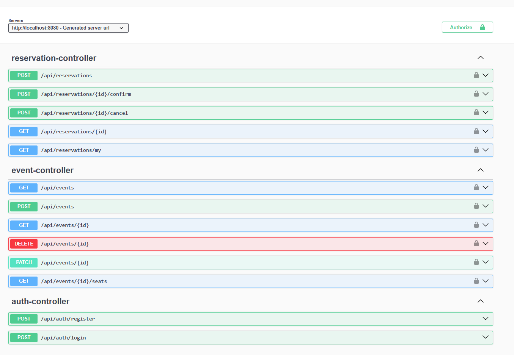
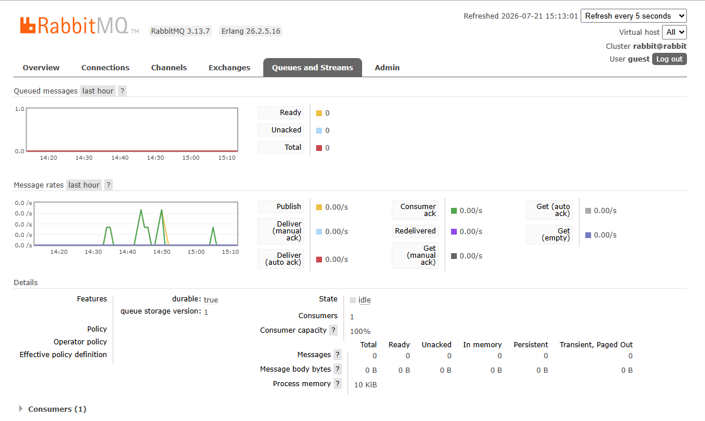
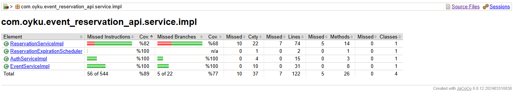
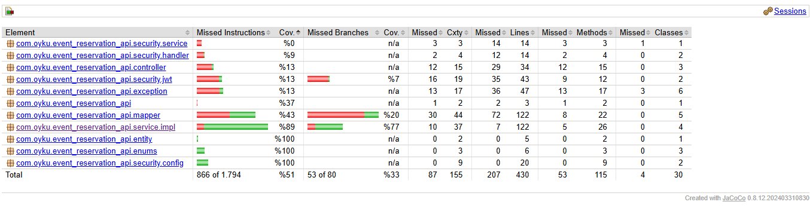

# 🎟️ Spring Boot Event Reservation REST API
 
<div align="center">
 
*A secure and scalable Event Reservation REST API built with Spring Boot, PostgreSQL, Redis, RabbitMQ, Docker, and Spring Security. The project demonstrates JWT authentication, role-based authorization, Redis caching, Redis-based rate limiting, asynchronous messaging with RabbitMQ, optimistic locking for concurrency control, scheduled tasks, comprehensive testing, and code coverage analysis.*


</div>

---
 
# 📌 Project Overview
 
Spring Boot Event Reservation API is a RESTful backend application developed for managing events and seat reservations securely and efficiently.
 
The project follows a layered architecture and demonstrates modern backend development concepts including JWT authentication, role-based authorization, DTO mapping, validation, global exception handling, scheduled tasks, optimistic locking, and comprehensive testing.
 
The application allows administrators to manage events while authenticated users can reserve, confirm, and cancel reservations. To improve performance, frequently accessed event data is cached using Redis. The API also includes Redis-based rate limiting to protect endpoints from excessive requests and integrates RabbitMQ for asynchronous reservation event processing.
 
The application infrastructure is fully containerized using Docker and Docker Compose for local development environments. PostgreSQL, Redis, and RabbitMQ services can be started together through Docker Compose with configured networking and persistent database storage.
 
For container orchestration and deployment scenarios, Kubernetes manifests are provided to run the complete backend infrastructure inside a Kubernetes cluster. The application, PostgreSQL, Redis, and RabbitMQ services are deployed using Kubernetes Deployments and Services, enabling container lifecycle management, internal service communication, and scalable deployment.
 
Data consistency is ensured through scheduled reservation expiration and JPA Optimistic Locking.
---
 
# 🚀 Features
 
## 🔐 Authentication & Authorization
 
- User registration
- User login with JWT
- Password encryption
- Stateless authentication
- Role-based authorization (ADMIN / USER)
- Protected REST endpoints
---
 
## 🎫 Event Management
 
- Create events
- Update events
- Delete events
- Retrieve all events
- Retrieve event details
- Automatic seat generation during event creation
- Retrieve seats for an event
---
 
## 🎟 Reservation Management
 
- Create reservations
- Confirm reservations
- Cancel reservations
- Retrieve reservation details
- Retrieve the authenticated user's reservations
- Automatic reservation expiration
- Automatic seat status management
---
 
## ⚡ Concurrency Control
 
- Prevents double booking using JPA Optimistic Locking (`@Version`)
---

## 🚀 Redis Caching

- Cache frequently accessed event data
- Automatic cache eviction on create, update and delete
- Improved response performance
---

## 🛡 Rate Limiting

- Redis-based IP rate limiting
- Prevents excessive API requests
- Returns HTTP 429 (Too Many Requests)
---

## 📨 RabbitMQ Messaging

- Publishes reservation events asynchronously
- Consumer processes messages independently
- Decouples business logic from message processing
- Improves scalability and responsiveness
---
  
## 🧪 Testing
 
- Service layer unit tests using JUnit 5 and Mockito
- Security integration tests using MockMvc
---
 
# 📑 API Documentation
 
Swagger UI is integrated into the project for interactive API documentation.

Swagger UI also allows authenticated requests using JWT Bearer tokens.
 
After running the application, the documentation is available at:
 
```
http://localhost:8080/swagger-ui/index.html
```
 
Using Swagger UI, you can:
 
- View all available REST endpoints
- Inspect request and response models
- Test endpoints directly from the browser
- Authenticate using JWT for protected endpoints
---
 
# 📷 Swagger Preview

### Swagger Endpoint List


 
---

### RabbitMQ Management Dashboard

Displays the configured queue together with producer and consumer activity during reservation processing.



---

## 🐳 Docker Containerization

- Application is packaged as a Docker image
- Docker Compose configuration is provided for local infrastructure setup
- PostgreSQL, Redis, and RabbitMQ services run as containers
- Persistent PostgreSQL storage is configured using Docker volumes
- Services communicate through Docker networking
---

## ☸️ Kubernetes Deployment

- Kubernetes manifests are provided for container orchestration
- Backend application runs inside Kubernetes Deployment
- PostgreSQL, Redis, and RabbitMQ are deployed as separate services
- Kubernetes Services enable internal service communication
- Application updates are managed using Kubernetes rollout strategies
- Local Kubernetes cluster deployment is tested using Docker Desktop Kubernetes
---

### JaCoCo Code Coverage

Service layer code coverage generated using JaCoCo.





---
 
# 🛠 Technology Stack
 
## Backend
 
```text
Java 23
Spring Boot
Spring MVC
Spring AMQP
Spring Cache
Spring Data JPA
Hibernate
Spring Security
RESTful API
Jakarta Bean Validation
```
 
## Database
 
```text
PostgreSQL
pgAdmin
```

 ## Caching

```text
Redis
Spring Cache
```

## Authentication
 
```text
JWT (JSON Web Token)
Spring Security
BCrypt Password Encoder
```
 
## Documentation
 
```text
Swagger / OpenAPI
```

## Messaging

```text
RabbitMQ
Spring AMQP
```
 
## Testing
 
```text
JUnit 5
Mockito
Spring Boot Test
MockMvc
JaCoCo
```
 
## Utilities
 
```text
MapStruct
Lombok
SLF4J Logging
```

## Infrastructure & Deployment
 
```text
Docker
Docker Compose
Docker Image
Docker Container
Docker Networking
Docker Volumes
Kubernetes
Kubernetes Deployment
Kubernetes Services
Kubernetes Pods
Kubernetes Configurations
```

---
 
# 🏗 Project Architecture
 
The project follows a layered architecture to ensure separation of concerns, maintainability, and scalability.
 
```text
                         Client
                            │
                            ▼
                  Kubernetes Service
                            │
                            ▼
          Event Reservation API Deployment
                            │
                            ▼
                  Application Pod
                            │
                            ▼
              Spring Security (JWT)
                            │
                            ▼
              Redis Rate Limiting Filter
                            │
                            ▼
                       Controller
                            │
                            ▼
                        Service
              ┌─────────────┼──────────────┐
              ▼             ▼              ▼
        Repository     Redis Cache    RabbitMQ Producer
              │                            │
              ▼                            ▼
        PostgreSQL Pod              RabbitMQ Queue
                                           │
                                           ▼
                              Reservation Consumer
```
 
The application infrastructure is separated into independent containerized services. Docker Compose provides a local development environment, while Kubernetes manages deployment, networking, and lifecycle of application components inside the cluster.

- **Controller** → Handles HTTP requests and responses.
- **Service** → Contains business logic.
- **Repository** → Performs database operations.
- **Entity** → Represents database tables.
- **DTO** → Transfers data between layers.
- **Mapper** → Converts Entities and DTOs using MapStruct.
---
 
# 📂 Project Structure
 
```text
src
└── main
    ├── java
    │   └── com.oyku.event_reservation_api
    │       ├── controller
    │       ├── dto
    │       ├── entity
    │       ├── enums
    │       ├── exception
    │       ├── mapper
    │       ├── messaging
    │       │     ├── consumer
    │       │     ├── dto
    │       │     └── producer
    │       ├── repository
    │       ├── security
    │       │     ├── config
    │       │     ├── handler
    │       │     ├── jwt
    │       │     ├── ratelimit
    │       │     └── service
    │       ├── service
    │       │     └── impl
    │       └── EventReservationApiApplication.java
    ├── Dockerfile
    ├── docker-compose.yml
    ├── k8s
    │   ├── event-api-deployment.yaml
    │   ├── event-api-service.yaml
    │   ├── postgres-deployment.yaml
    │   ├── postgres-service.yaml
    │   ├── redis-deployment.yaml
    │   ├── redis-service.yaml
    │   ├── rabbitmq-deployment.yaml
    │   └── rabbitmq-service.yaml
    │
    └── resources
          └── application.properties
```
 
---
 
# 🔄 Request Flow
 
```text
Client
   │
   ▼
Kubernetes Service
   │
   ▼
Event Reservation API Container
   │
   ▼
Rate Limiting (Redis)
   │
   ▼
JWT Authentication
   │
   ▼
Controller
   │
   ▼
Service
   │
   ├────────► Redis Cache
   │
   ├────────► RabbitMQ Producer
   │
   ▼
Repository
   │
   ▼
PostgreSQL Container
   │
   ▼
Response DTO
```
 
---
 
# 📦 API Endpoints
 
## 🔐 Authentication
 
| Method | Endpoint | Description |
| ------ | -------- | ----------- |
| POST | `/api/auth/register` | Register a new user |
| POST | `/api/auth/login` | Authenticate user and generate JWT |
 
---
 
## 🎫 Events
 
| Method | Endpoint | Description | Access |
| ------ | -------- | ----------- | ------ |
| POST | `/api/events` | Create a new event | ADMIN |
| GET | `/api/events` | Retrieve all events | USER / ADMIN |
| GET | `/api/events/{id}` | Retrieve event details | USER / ADMIN |
| PUT | `/api/events/{id}` | Update an event | ADMIN |
| DELETE | `/api/events/{id}` | Delete an event | ADMIN |
| GET | `/api/events/{id}/seats` | Retrieve seats for an event | USER / ADMIN |
 
---
 
## 🎟 Reservations
 
| Method | Endpoint | Description | Access |
| ------ | -------- | ----------- | ------ |
| POST | `/api/reservations` | Create a reservation | USER |
| GET | `/api/reservations/{id}` | Retrieve reservation details | USER |
| GET | `/api/reservations/my` | Retrieve the authenticated user's reservations | USER |
| PATCH | `/api/reservations/{id}/confirm` | Confirm reservation | USER |
| PATCH | `/api/reservations/{id}/cancel` | Cancel reservation | USER |
 
---
 
# 🔒 Security
 
The application secures REST endpoints using Spring Security and JWT Authentication.
 
Authorization rules include:
 
| Role | Permissions |
|------|-------------|
| **ADMIN** | Create, update and delete events |
| **USER** | View events, view seats, create reservations, confirm reservations and cancel reservations |
 
All protected endpoints require a valid JWT token in the request header.
 
```http
Authorization: Bearer <jwt-token>
```
 
---
 
# ⚡ Concurrency Handling
 
To prevent multiple users from reserving the same seat simultaneously, the application uses **JPA Optimistic Locking**.
 
Each seat entity contains a version field:
 
```java
@Version
private Long version;
```
 
If two users attempt to reserve the same seat at the same time:
 
- the first transaction succeeds,
- the second transaction fails,
- data consistency is preserved,
- duplicate reservations are prevented.
---
 
# ⏰ Scheduled Reservation Expiration
 
Reservations remain in **HELD** status for a limited time.
 
A scheduled task periodically checks expired reservations and automatically:
 
- changes reservation status to **EXPIRED**
- updates the seat status to **AVAILABLE**
This ensures that seats are automatically released when users do not confirm their reservations.
 
---

 
# 🧪 Testing
 
The project includes both unit and integration tests to ensure application reliability and security.

The application has also been verified inside a Kubernetes environment to ensure successful startup, database connectivity, cache communication, and message broker integration.
 
## Unit Testing
 
Service layer components are tested using:
 
- JUnit 5
- Mockito
The unit tests cover:
 
- User registration
- User authentication
- Event management
- Reservation creation
- Reservation confirmation
- Reservation cancellation
- Business validation rules
- Exception scenarios
---
 
## Integration Testing
 
Security integration tests are implemented using:
 
- Spring Boot Test
- MockMvc
- Spring Security Test
Integration tests verify:
 
- Protected endpoint access
- JWT authentication flow
- Role-based authorization
- ADMIN and USER permissions
---

## Code Coverage

The project uses **JaCoCo** to measure test coverage and evaluate the effectiveness of unit tests.

Current service layer code coverage is approximately **75%**, covering core business logic, validation rules, and exception scenarios.

---
 
# ⚙️ Installation

## Prerequisites

Before running the application, make sure the following tools are installed:

- Java 23
- Maven
- Docker Desktop
- Docker Compose
- Kubernetes
- kubectl
- IntelliJ IDEA or Eclipse

---

## Clone Repository

```bash
git clone https://github.com/OykuEyuboglu/event-reservation-api.git
```

---

## Navigate to Project

```bash
cd event-reservation-api
```

---

# 🐳 Docker Deployment

The project provides Docker support for running the complete backend infrastructure in a local development environment.

Docker is used for:

- Containerized Spring Boot application deployment
- PostgreSQL database container
- Redis cache and rate limiting service
- RabbitMQ message broker
- Persistent storage management using Docker volumes
- Service communication through Docker networking

The local infrastructure can be started using Docker Compose.

The Docker Compose configuration is defined in:

```
docker-compose.yml
```

The Docker Compose setup includes:

- PostgreSQL container with persistent database storage
- Redis container for caching and rate limiting
- RabbitMQ container for asynchronous messaging
- Configured network communication between services

---

## Start Services with Docker Compose

Run:

```bash
docker compose up -d
```

This command starts all required infrastructure services as isolated containers.

To check running containers:

```bash
docker ps
```

To view container logs:

```bash
docker compose logs
```

To stop all Docker Compose services:

```bash
docker compose down
```

To remove containers together with volumes:

```bash
docker compose down -v
```

---

# 🗄 Database Configuration

The application uses PostgreSQL as the relational database.

Database configuration is managed through:

```
src/main/resources/application.properties
```

Example configuration:

```properties
spring.datasource.url=...
spring.datasource.username=...
spring.datasource.password=...

spring.data.redis.host=localhost
spring.data.redis.port=6379

spring.rabbitmq.host=localhost
spring.rabbitmq.port=5672
spring.rabbitmq.username=guest
spring.rabbitmq.password=guest

spring.jpa.hibernate.ddl-auto=update
```

---

# ☸️ Kubernetes Deployment

The project also includes Kubernetes deployment configurations for running the complete backend infrastructure inside a Kubernetes cluster.

Kubernetes manages:

- Application deployment
- PostgreSQL database
- Redis cache service
- RabbitMQ message broker
- Internal service communication

Kubernetes manifests are located under:

```
k8s/
```

---

## Kubernetes Resources

The project contains Kubernetes configurations for:

```
k8s
├── event-api-deployment.yaml
├── event-api-service.yaml
├── postgres-deployment.yaml
├── postgres-service.yaml
├── redis-deployment.yaml
├── redis-service.yaml
├── rabbitmq-deployment.yaml
└── rabbitmq-service.yaml
```

---

## Build Application Image

Before deploying to Kubernetes, create the Docker image:

```bash
mvn clean package -DskipTests
```

Build Docker image:

```bash
docker build -t event-reservation-api:latest .
```

---

## Deploy Application to Kubernetes

Apply Kubernetes configurations:

```bash
kubectl apply -f k8s/
```

Check running pods:

```bash
kubectl get pods
```

Expected services:

```
event-reservation-api
postgres
redis
rabbitmq
```

---

## Update Kubernetes Deployment

After making application changes:

Build the new application:

```bash
mvn clean package -DskipTests
```

Create the updated Docker image:

```bash
docker build -t event-reservation-api:latest .
```

Restart Kubernetes deployment:

```bash
kubectl rollout restart deployment event-reservation-api
```

Verify deployment status:

```bash
kubectl get pods
```

---

# 📦 Install Dependencies

Install Maven dependencies:

```bash
mvn clean install
```

---

# ▶️ Run Application Locally

Start the Spring Boot application:

```bash
mvn spring-boot:run
```

The application starts at:

```
http://localhost:8080
```

---

# 📑 Open Swagger UI

Swagger documentation is available at:

```
http://localhost:8080/swagger-ui/index.html
```

Swagger UI allows:

- Viewing all REST endpoints
- Testing API requests
- Sending authenticated requests using JWT Bearer tokens

---

# 🐰 RabbitMQ Management UI

RabbitMQ management dashboard:

```
http://localhost:15672
```

Default credentials:

```
Username: guest
Password: guest
```

---

# 🔍 Useful Kubernetes Commands

Check all resources:

```bash
kubectl get all
```

View application logs:

```bash
kubectl logs deployment/event-reservation-api
```

Access PostgreSQL container:

```bash
kubectl exec -it postgres-pod-name -- psql -U postgres
```

Delete Kubernetes resources:

```bash
kubectl delete -f k8s/
```
 
# 📚 Key Concepts Covered
 
This project demonstrates practical experience with modern backend development and deployment practices:

- Spring Boot
- Spring MVC
- Spring Data JPA
- Hibernate
- PostgreSQL
- Spring Security
- JWT Authentication
- Role-Based Authorization
- REST API Design
- Layered Architecture
- DTO Pattern
- MapStruct
- Global Exception Handling
- Bean Validation
- Scheduled Tasks
- Optimistic Locking
- Concurrency Control
- Redis
- Spring Cache
- Redis Rate Limiting
- RabbitMQ
- Asynchronous Messaging
- Docker
- Docker Compose
- Containerized Application Deployment
- Kubernetes
- Kubernetes Deployment
- Kubernetes Services
- Kubernetes Resource Management
- Spring AMQP
- Unit Testing with Mockito
- Integration Testing with MockMvc
- Code Coverage (JaCoCo)
- Swagger / OpenAPI
- SLF4J Logging
- Clean Code Principles
---

# 👩‍💻 Author
 
**Dila Öykü Eyüboğlu**
